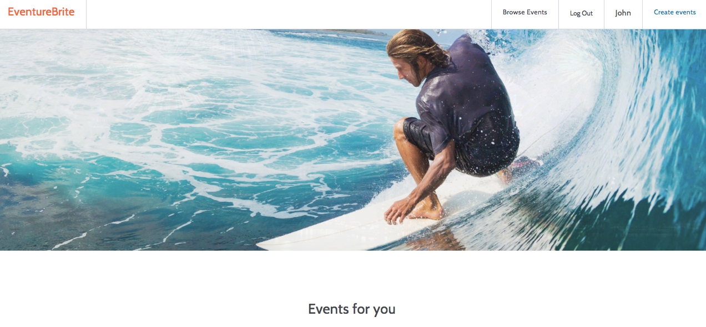
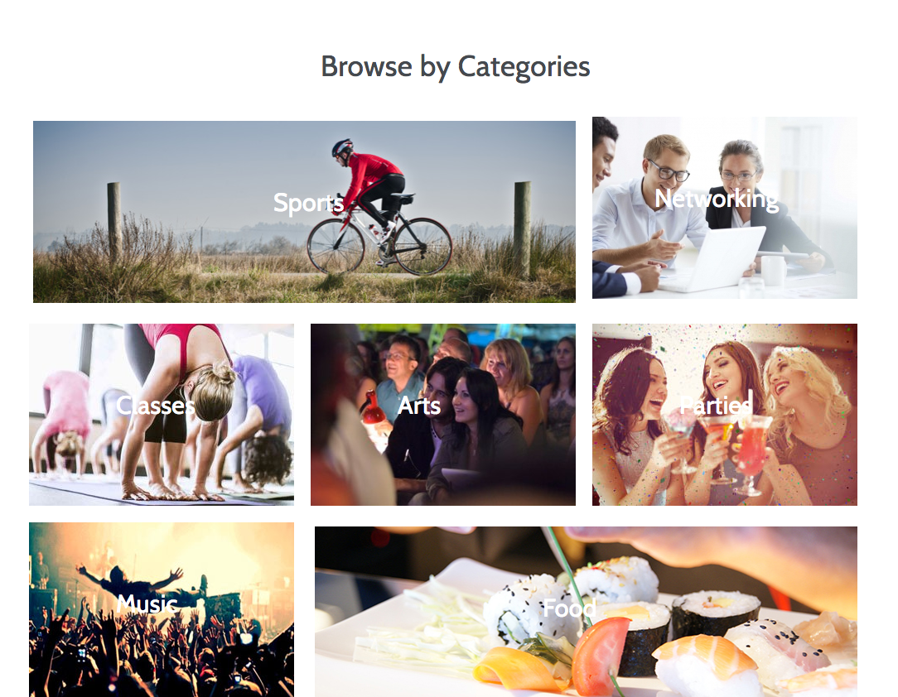
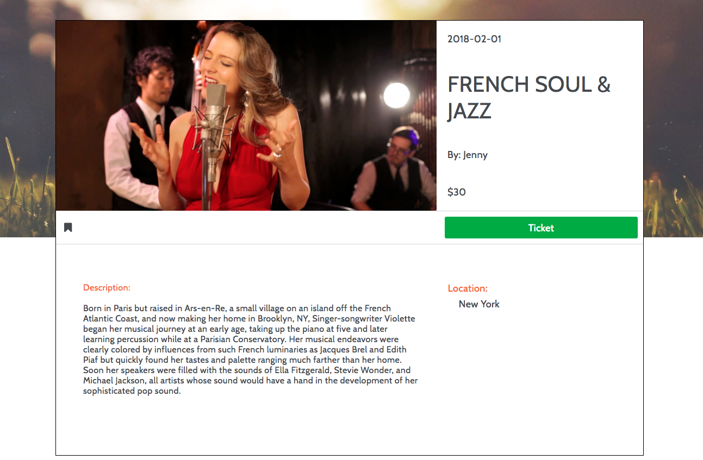
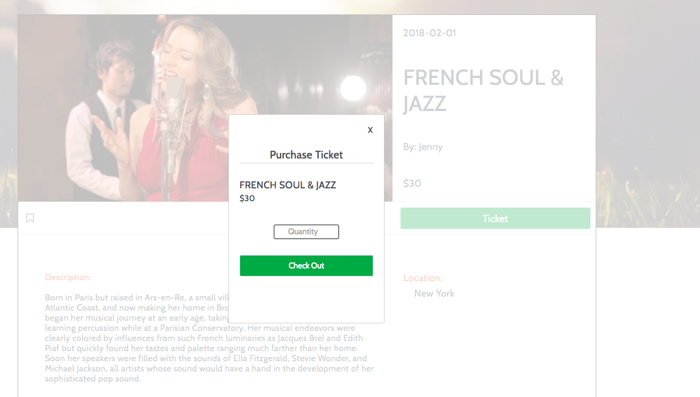

# Eventure

[Live Link](https://eventurebrite.herokuapp.com/#/)


## Background

Eventurebrite is a full stack web application that was inspired by Eventbrite. It was built using Ruby on Rails with Postgres for the backend and React and Redux for the frontend. The application allows users to host events, bookmark events, search events by categories, and purchase tickets.


## Features

EventureBrite allows users to:
- Create an account
- Create/Edit an Event
- Host Events
- View Events
- Filter Events by Category
- Register/Purchase Tickets
- Bookmark Events

### Landing Page
<p align="center">
    
</p>

On the landing page, the hero image fades four pictures in and out in five second intervals. The user is able to sign up, log in, and log out using the nav bar where upon click, a modal will appear.   

### Authentication
Passwords are well protected and is not stored in the database directly. It is instead, salted and hashed into digests using BCrypt to ensure maximum security. Upon User request to log in, the password is salted and hashed again to compare the new digest with the one stored in the database. Users are then given a session-token which is used to verify user credentials through out the site.


### Event Categories

<p align="center">
    
</p>

<p align="center">
    
</p>

Users are able to search events by categories by toggling individual category on the browse page. On click, the EventBrowse component dispatches the `filterByCategory` action which sends an ajax request to the 'GET' controller. The controller then filters the data from the data base, using active record queries. Then sends back a success and a JSON object to the Redux Store.

Code Sample of the active record query used for event category:
Note: the '?' is used to prevent CSRF injections into the data base.

```Ruby
def index
  if params[:category]
    @events  = Event.joins(:categories).where("categories.category = ?", params[:category]).limit(params[:limit])
  else
    @events = Event.limit(params[:limit]) || Event.all
  end

  render 'api/events/index'
end
```

### Event Details/Tickets

<p align="center">
    
</p>

<p align="center">
    
</p>

Event Detail Page displays the Event information. On this page, the user can either register/purchase tickets or edit the event depending on if the event is the user's event. The green button is responsive and will display 'tickets' or 'edit' depending on the users relationship with the event. When logged out, the user will be asked to log in before purchasing the tickets.

Code sample below checks if the user is logged in. If so, it checks if the event belongs to the user. Depending on the status, the button will render as 'ticket' or 'edit' accordingly.

``` Javascript
render() {
  if(!this.props.event.user){
    return <div>Loading</div>;
  }

  let content = (this.props.currentUser !== null) ? <TicketFormContainer/> : <SessionFormContainer formType="login" />;

  let ticketOrEditButton;
  if (this.props.currentUser !== null){
    ticketOrEditButton = this.checkUserEvent();
  }
  else{
    ticketOrEditButton = <p className="detail-event-ticket" onClick={this.handleTicket.bind(this)}>Ticket</p>;
  }
}

checkUserEvent(){
  if (this.props.currentUser.id === this.props.event.user.id){
    return <p className="detail-event-edit" onClick={this.handleEdit(this.props.eventId)}>Edit</p>;
  }
  else{
    return <p className="detail-event-ticket" onClick={this.handleTicket.bind(this)}>Ticket</p>;
  }
}

```

### Bookmark

Signed in users can bookmark events by toggling the bookmark icon, changing the color depending on whether the event has been bookmarked or not. On click, it updates the User's bookmarked event allowing the user to view the bookmarked events in his/her profile page.

### Create Events

When creating or editing an event, the user is able to upload images from their desktop. EventureBrite is linked with Cloundinary, where it stores all of the images living on the site.
