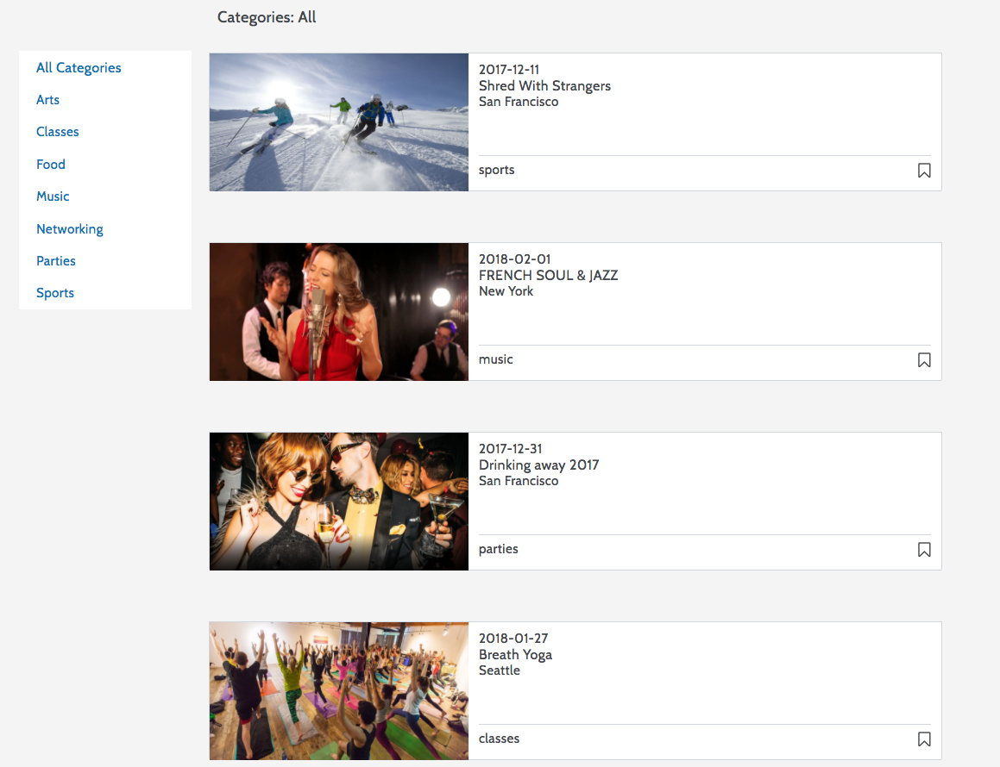

# Eventure

[EventureBrite link][eventurebrite]

[eventurebrite]: eventurebrite.herokuapp.com

## Background

Eventurebrite is a single page web application inspired by Eventbrite built using Ruby on Rails and React.js + Redux.

## Features

EventureBrite allows users to:
- Create an account
- Create/Edit an Event
- Host Events
- View Events
- Filter Events by Category
- Register/Purchase Tickets
- Bookmark Events

### Landing Page

    

On the landing page, the hero image fades four pictures in and out in five second intervals. The user is able to sign up, log in, and log out using the nav bar where upon click, a modal will appear.   

### Event Categories

    

    

Users are able to search events by categories by toggling individual category on the browse page. On click, the EventBrowse component dispatches the `filterByCategory` action which sends an ajax request to the 'GET' controller. The controller then filters the data from the data base, using active record queries. Then sends back a success and a JSON object to the Redux Store.

### Event Details/Tickets

    

    

Event Detail Page displays the Event information. On this page, the user can either register/purchase tickets or edit the event depending on if the event is the user's event.
When logged out, the user will be asked to log in.

### Bookmark

Signed in users can bookmark events by toggling the bookmark icon, changing the color depending on whether the event has been bookmarked or not. On click, it updates the User's bookmarked event allowing the user to view the bookmarked events in his/her profile page.

### Create Events

When creating or editing an event, the user is able to upload images from their desktop. EventureBrite is linked with Cloundinary, where it stores all of the images living on the site.

## Future Direction  

Implement Google Maps Integration

Implement Search Bar
